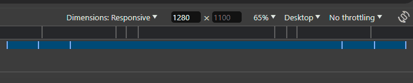

# Software Engineering Project: Around The U.S.

This is a project for Sprints 3-8 in the TripleTen Software Engineering Practicum. The layout should show adaptive web design, and the elements should all display correctly on popular screen sizes: 1280px given for the desktop view and 320px given for the mobile view. Transitions between these sizes are made to be smooth and readable. Additionally, there is functionality to edit the profile information, add new cards to the gallery, and 'like' separate cards or delete gallery posts. Finally, each modal popup is responsive to the edit and add buttons in profile section, with form validation required for submission.

## Programming Languages and Features

### HTML5

- Flexbox
- Grid Layout
- Semantic Tags

### CSS

- BEM File Structure
- Transitions
- Media Queries

### JavaScript

- Basic & Callback functions
- ForEach loop
- Object array
- Event listeners for 'Esc', 'Click', and 'Submit'
- Semantically appropriate variable names
- Custom Form Validation
- OOP & Modular Classes

## Links

**Design Specifications**

- [Project 3](https://www.figma.com/file/ii4xxsJ0ghevUOcssTlHZv/Sprint-3%3A-Around-the-US?node-id=0%3A1) on Figma
- [Project 4](https://www.figma.com/design/EO5AaNCuzzFL7X5gSY7HwQ/Sprint-4_-Around-The-U.S.-_-desktop-%2B-mobile?node-id=7505-2&t=DrP94UpXd1HfbYvK-0) on Figma
- [Project 5](<https://www.figma.com/design/JFPhASqvZ5pBjQV2ouUlim/Sprint-5_-Around-The-U.S.-_-desktop-%2B-mobile-(Copy)?node-id=0-1&p=f&t=bEg0SRjyUwcqDETV-0>) on Figma
- [Project 6](https://www.figma.com/design/N3zUeequnpvMX807FfYAZW/Sprint-6-Around-The-U.S.?node-id=0-1&p=f&t=xgMAU5UTCCWWjenU-0) on Figma
- Projects 7 & 8 are specific to JavaScript modules, without introduction of new functionality or design.

**Active URL**

- Hosted on [GitHub Pages](https://MegElizaEgg.github.io/se_project_aroundtheus)

**Video Summary**

- Watch a video overview for Project 3 and the introduction of Media Queries, only on [Loom](https://www.loom.com/share/9ee070fd3a9947cfad956f9015340f21?sid=a3d1061a-a36e-452a-a3b1-80546ad17296).
